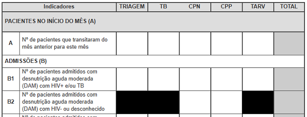

# Totalizador de Resumo Mensal de PRN II

O **Totalizador de Resumo Mensal de PRN II** é um serviço online gratuito que auxilia na elaboração, como o nome sugere, do resumo mensal de PRN II (Programa de Reabilitação Nutricional para Pacientes ≥ 15 anos), por meio do cálculo automático dos totais com base nos dados preenchidos pelo usuário. Foi criado de acordo com o modelo da ficha de resumo mensal de PRN II actualmente vigente no Serviço Nacional de Saúde em Moçambique.

## Objectivos

* Auxiliar os Profissionais de Saúde na totalização do resumo mensal de PRN II com exatidão e prontidão;

* Minimizar possíveis erros de totalização (por exemplo, somar involuntariamente células não correspondentes ou registar o total da linha A, na linha B);

* Expandir o acesso à ficha de resumo mensal de PRN II.

## O que eu preciso dispor para, e como utilizar o totalizador?

* Um celular ou computador com acesso à internet.

* Ter colhido os dados de todos os indicadores da ficha nas fontes primárias (livro(s) de registo de PRN para pacientes ≥ 15 anos) da sua Unidade Sanitária.

* E por fim, preencher os dados nas células correspondentes em função do indicador e serviço (Triagem, TB, CPN, CPP, TARV) e consequentemente os respectivos totais são, em tempo real, correcta e automaticamente calculados.

>[!NOTE]
>
> O totalizador garante um resumo correctamente totalizado, contudo, a qualidade de um resumo não se limita apenas à uma correcta totalização. Outros factores não dependentes do totalizador como preenchimento correcto dos livros de registo, colheita de dados abrangente a todas as fontes primárias (livros de registo) com informação do mês em reporte, concordância de dados, entre outros, influenciam sobremaneira na qualidade de um resumo mensal.

## Qual é o destino dos dados que eu insiro?

São guardados no seu celular ou computador, por meio de um recurso chamado [Web Storage](https://developer.mozilla.org/pt-BR/docs/Web/API/Web_Storage_API) e você tem total controle sobre os dados, podendo mantê-los ou apagá-los por meio da opção "Esvaziar ficha" no menu do totalizador ou excluindo os dados de navegação (histórico) do navegador.

## Vantagens do totalizador

* Calcula automaticamente os totais;

* Preenche automaticamente as células correspondentes aos totais;

* Fornece resultados (totais) exactos;

* Flexibiliza a elaboração do resumo;

* Pode ser impresso, inclusíve como uma simples ficha de resumo mensal;

* Pode ser guardado como PDF.

## Limitações do totalizador

* Não alerta sobre discrepância de dados, portanto, a análise da concordância dos dados é inteiramente dependente do usuário.